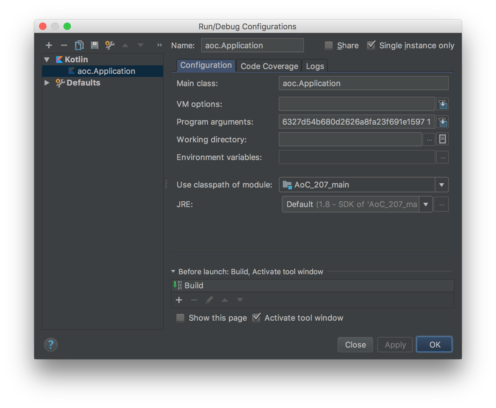

# Advent of Code 2017

## Introduction

This repository contains a bootstrap project for Advent of Code 2017.

Assignment data is cached within the project.
The Framework either retrieves the local data (if available) or otherwise retrieves the data from the server.
If you want to use the framework for your own assignments, make sure to delete all contents of the `data/` folder after forking.

## Running the application

To start fetching assignments for your project, you need to get a session token to authenticate.

To do this, use your the developer tools of your web browser:

 - Go to [AdventOfCode.com](https://adventofcode.com)
 - Login
 - Open the developer tools of your browser (on Safari and Firefox for macOS you can press `CMD` + `Alt` + `I`.)
 - Switch to the networking tab of the developer tools
 - Reload the page
 - Find the session key in the headers from one of the requests

### Commandline

Building the jar file:

```
./gradlew jar
```

Running the jar file:

```
java -jar build/libs/AdventOfCode2017.jar [sessionToken] [day]
```

A session token can be fetched by logging in on your browser and debugging the browser request.

### IntelliJ IDEA

Create a new run configuration and enter the following data:



## Adding more solutions

If you want to add a new day you need to create a new solution class and append it to the `solutions` array in the `Application` class.
